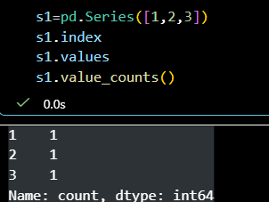
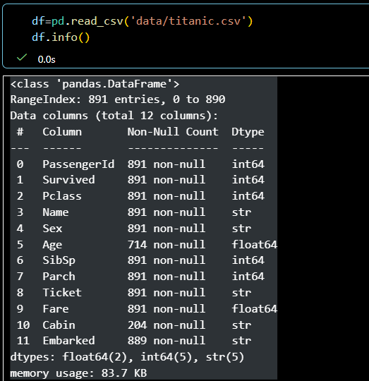

# 데이터 전처리
이 문서에서는 python의 데이터 전처리 과정을 간략하게 다룹니다.

## 사용하는 라이브러리
Python 데이터 처리에는 pandas라는 라이브러리를 사용합니다.
이 라이브러리는 Series와 DataFrame이라는 두 가지 자료 형태를 사용하고 있습니다.

### Series
- Series는 길이가 1인 배열로, Vector를 생각하면 편합니다.

특징은, index와 value가 마치 key:Value pair처럼 저장되어 있다는 점입니다.
다만 이 index는 실제 series의 길이에 영향을 주지는 않기 때문에,
배열에서 [0], [1]처럼 element에 접근하는 index라고 생각하면 편합니다.

value counts라는 함수를 통해 중복없이 unique한 값들이 몇 개가 있는지 셀 수 있습니다.

### Data Frame
- DataFrame은 Matrix로 이해하면 편합니다.
SQL에서 사용하는 Table과 유사한 구조로 되어있는데, 0번째 행이 column을 가리키고 있습니다.

df.info()라는 함수를 통해서, data frame에 속한 데이터들의 타입과 개수를
확인할 수 있습니다.
특히 눈여겨 볼 부분은 Dtype과 Non-null입니다.

Dtype이 중요한 이유는, 숫자데이터가 문자 형식으로 저장되어 있을 가능성이 있어 데이터 처리시 타입 오류를 방지하기 위함입니다.

Non-null의 개수를 통해 실제 누락된 데이터의 개수를 확인할 수 있는데,
누락된 데이터가 많으면 해당 데이터는 활용하기 어렵기 때문에, 해당 column을
버리거나, 누락 정도가 심하지 않다면 주변 값으로 interpolation할 방법을 찾아야 합니다.

