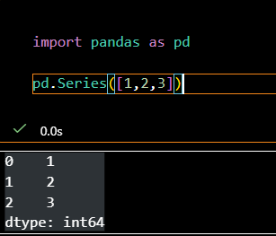

# 데이터 전처리
이 문서에서는 python의 데이터 전처리 과정을 간략하게 다룹니다.

## 사용하는 라이브러리
Python 데이터 처리에는 pandas라는 라이브러리를 사용합니다.
이 라이브러리는 Series와 DataFrame이라는 두 가지 자료 형태를 사용하고 있습니다.

### 자료구조: Series와 DataFrame
- Series는 길이가 1인 배열로, Vector를 생각하면 편합니다.
